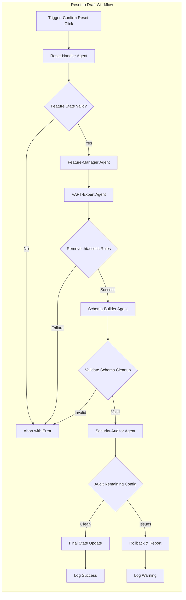

# AGENTS.md — Multi-Agent Orchestration for VAPTSecure

> Multi-agent system configuration for complex security workflows

---

## 🤖 Agent Registry

### Primary Agents

| Agent | Role | Trigger | Priority |
|-------|------|---------|----------|
| **VAPT-Expert** | Security rule generation & validation | `@vapt-expert` | P0 |
| **Security-Auditor** | Security audit & compliance review | `@security-audit` | P1 |
| **Schema-Builder** | JSON schema validation & generation | `@schema-build` | P2 |
| **Feature-Manager** | Feature lifecycle management | `@feature` | P1 |
| **Reset-Handler** | Reset to Draft orchestration | `@reset-draft` | P0 |

---

## 🔄 Workflows

### Workflow: Reset to Draft

**Purpose**: Handle "Confirm Reset (Wipe Data)" operation when reverting from Develop to Draft

**Trigger**: User clicks "Confirm Reset (Wipe Data)" on the "Reset to Draft" modal

#### Agent Orchestration



#### Agent Responsibilities

**Reset-Handler Agent (Coordination)**
```yaml
type: orchestrator
tasks:
  - parse_reset_request:
      input: ["feature_id", "current_state", "user_id"]
      validation:
        - verify_state: "Develop"
        - confirm_user_permission: true
  - dispatch_agents:
      parallel: false
      sequence:
        - Feature-Manager: prepare_reset
        - VAPT-Expert: remove_security_rules
        - Schema-Builder: cleanup_schema
        - Security-Auditor: verify_removal
        - Feature-Manager: finalize_reset
```

**VAPT-Expert Agent (.htaccess Cleanup)**
```yaml
type: specialist
tasks:
  - identify_rules_to_remove:
      scope: "feature-specific"
      markers:
        - "# BEGIN VAPT-FR-{FEATURE-ID}"
        - "# VAPT-CONFIG-ID: {config_id}"
  - backup_existing_htaccess:
      path: "backups/.htaccess.{timestamp}.backup"
      compress: true
  - remove_marked_sections:
      safety_checks:
        - preserve_wordpress_core: true
        - validate_syntax_after: true
      rollback_on_error: true
  - verify_removal:
      test_endpoints:
        - "/wp-admin/"
        - "/wp-json/"
        - "/wp-json/vaptsecure/v1/"
```

**Feature-Manager Agent (State Management)**
```yaml
type: specialist
tasks:
  - prepare_reset:
      lock_feature: true
      create_snapshot:
        - feature_meta
        - database_state
        - config_files
      
  - finalize_reset:
      update_state:
        feature_id: "{FEATURE-ID}"
        new_state: "Draft"
        previous_state: "Develop"
      log_transition:
        table: "vapt_feature_history"
        fields:
          - feature_id
          - transition: "Develop → Draft (Reset)"
          - user_id
          - timestamp
          - snapshot_reference
      unlock_feature: true
```

**Schema-Builder Agent (JSON Cleanup)**
```yaml
type: specialist
tasks:
  - remove_generated_files:
      patterns:
        - "data/generated/{FEATURE-ID}/**/*.json"
        - "data/feature-cache/{FEATURE-ID}.*"
      archive: false
      
  - cleanup_interface_schemas:
      remove_entries:
        - interface_schema_v2.0.json:paths
        - feature_registry.json:features
      validate_remaining: true
```

**Security-Auditor Agent (Verification)**
```yaml
type: specialist
tasks:
  - verify_clean_state:
      checks:
        - no_orphaned_htaccess_rules: true
        - no_rogue_config_files: true
        - database_consistency: true
      
  - audit_report:
      generate:
        - pre_reset_state
        - post_reset_state
        - changes_summary
        - recommendations
```

---

## 📝 Communication Protocol

### Inter-Agent Messages

```json
{
  "message_type": "agent_dispatch",
  "workflow_id": "reset-to-draft-{timestamp}",
  "sender": "Reset-Handler",
  "recipient": "VAPT-Expert",
  "payload": {
    "task": "remove_htaccess_rules",
    "feature_id": "RISK-001",
    "config_ids": ["CONF-123", "CONF-124"],
    "htaccess_path": "/var/www/html/.htaccess",
    "priority": "P0",
    "deadline": "30s"
  },
  "response_format": "json",
  "error_recovery": "rollback"
}
```

### Response Format

```json
{
  "message_type": "agent_response",
  "workflow_id": "reset-to-draft-{timestamp}",
  "sender": "VAPT-Expert",
  "recipient": "Reset-Handler",
  "status": "success|partial|error",
  "result": {
    "rules_removed": 2,
    "backup_created": "/path/to/.htaccess.backup",
    "validation_passed": true
  },
  "warnings": [],
  "errors": []
}
```

---

## 🛡️ Error Handling

### Failure Recovery

When any agent fails during the Reset to Draft workflow:

1. **Immediate Stop**: Halt all agent operations
2. **Rollback Initiated**: Use last good snapshot
3. **User Notification**: Alert user with specific error
4. **Log Failure**: Record full error trace
5. **Maintain State**: Keep feature in consistent state

### Rollback Actions

```yaml
rollback_strategy:
  vapt-expert_failure:
    action: restore_htaccess_backup
    notify: user,admin
    
  feature-manager_failure:
    action: manual_intervention_required
    priority: critical
    
  schema-builder_failure:
    action: cleanup_later_queue
    continue_with_warning: true
    
  security-auditor_failure:
    action: flag_for_manual_review
    continue_with_notes: true
```

---

## 🎯 Special Instructions

### @reset-draft Invocation

When the "Confirm Reset" button is clicked in the modal:

```
USER: [Clicks "Confirm Reset (Wipe Data)"]

AGENT: Reset-Handler
RESPONSE: Initiating reset workflow for feature {feature_id}

AGENT: VAPT-Expert
ACTION: Removing .htaccess rules added during deployment
DETAIL: Found 2 rule blocks: # BEGIN VAPT-FR-001, # BEGIN VAPT-FR-002
STATUS: Removed, backup created at backups/.htaccess.20250314.001.backup

AGENT: Feature-Manager
ACTION: Updating feature state
DETAIL: State change: Develop → Draft
         Wiping data from: wp_vapt_features, wp_vapt_feature_meta
STATUS: Complete, 47 rows removed

AGENT: Schema-Builder
ACTION: Cleaning generated JSON files
DETAIL: Removed: data/generated/FR-001/*.json
STATUS: Complete

AGENT: Security-Auditor
ACTION: Verifying clean state
DETAIL: No orphaned rules found. Database consistent. Config files clean.
STATUS: Audit passed

AGENT: Reset-Handler
RESPONSE: Reset to Draft completed successfully.
         Actions performed:
         - 2 .htaccess rule blocks removed
         - Feature data wiped (47 records)
         - Config files cleaned
         - State updated to Draft
```

---

## 🔗 Editor Integration

### Cursor
```
@reset-draft feature_id=RISK-001 user_id=42
```

### Claude
```
/reset-draft --feature RISK-001 --user 42 --confirm
```

### Custom Interface
```javascript
// Via Reset to Draft Modal
VAPT.resetToDraft({
  featureId: 'RISK-001',
  userId: 42,
  confirm: true,
  wipeData: true,
  triggerAgents: ['reset-handler', 'vapt-expert', 'feature-manager', 'schema-builder', 'security-auditor']
});
```

---

*Last updated: March 2025*
*Version: 1.0.0*
