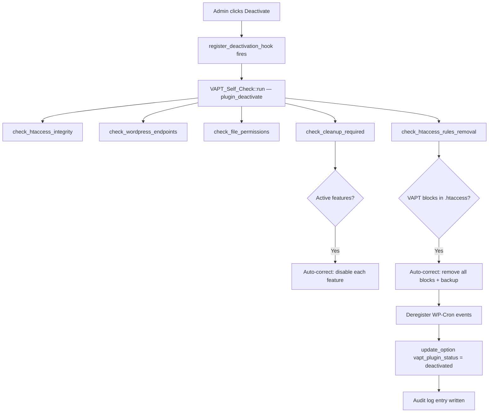
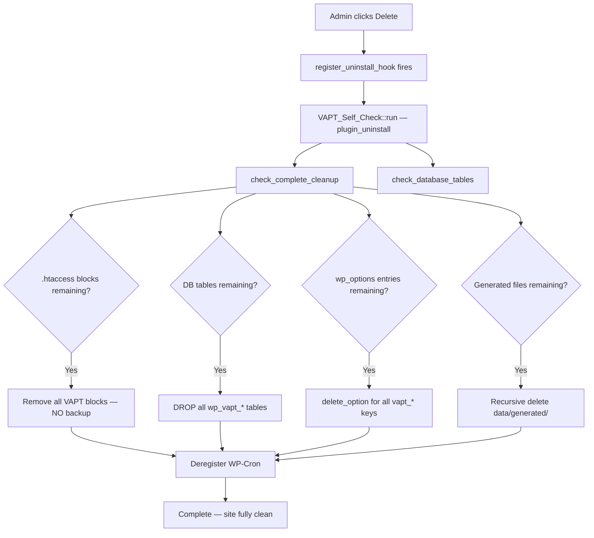
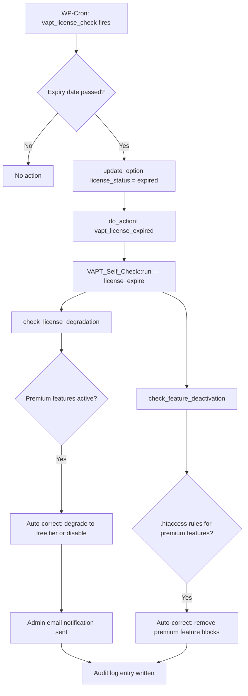
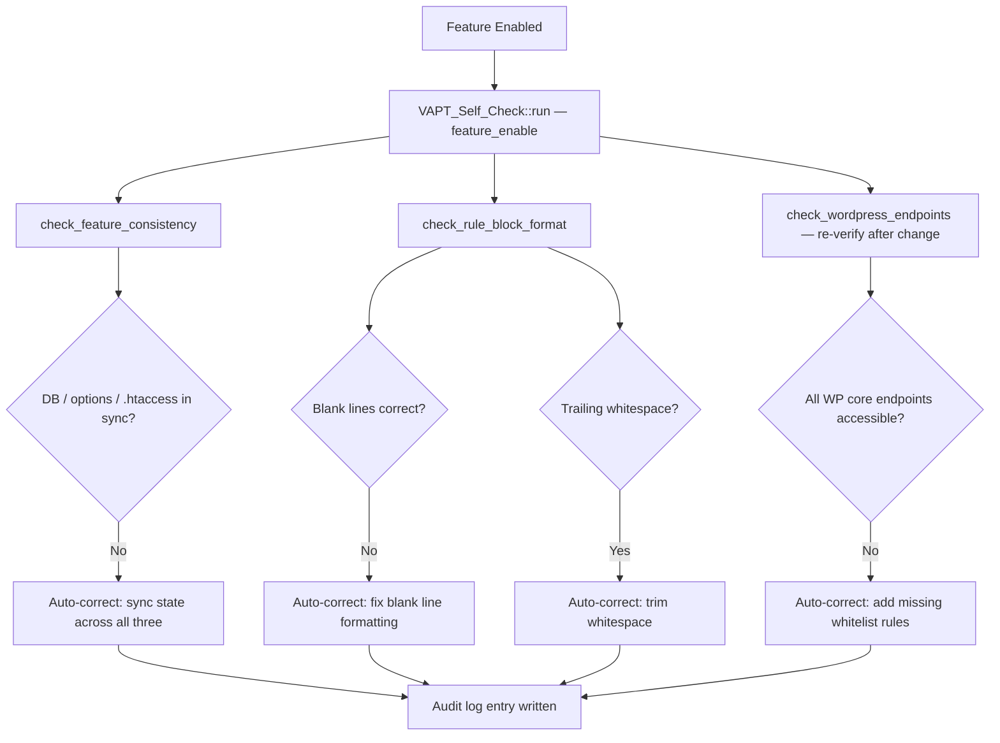
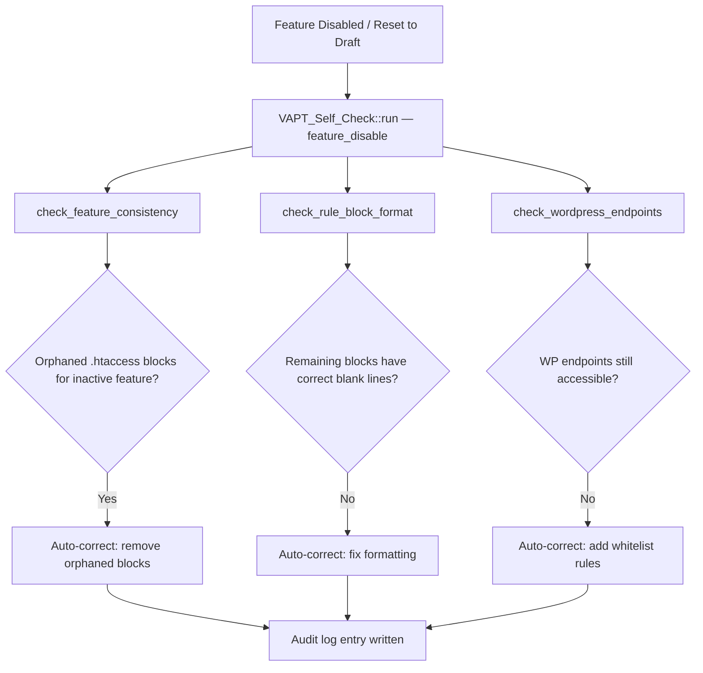
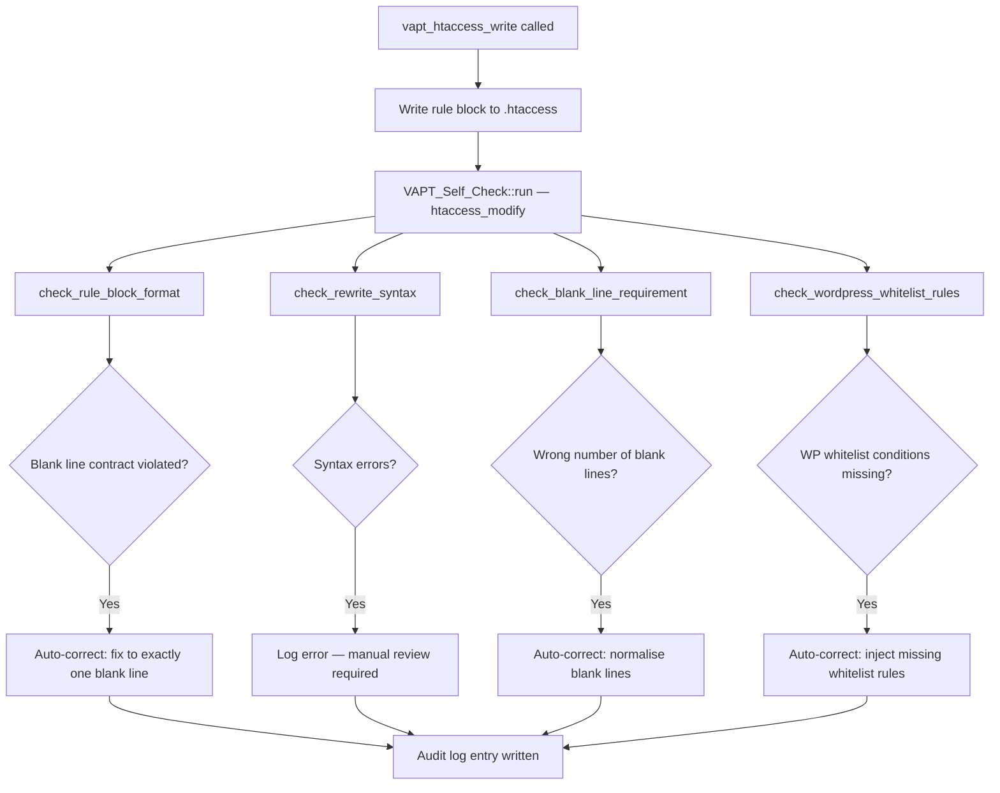
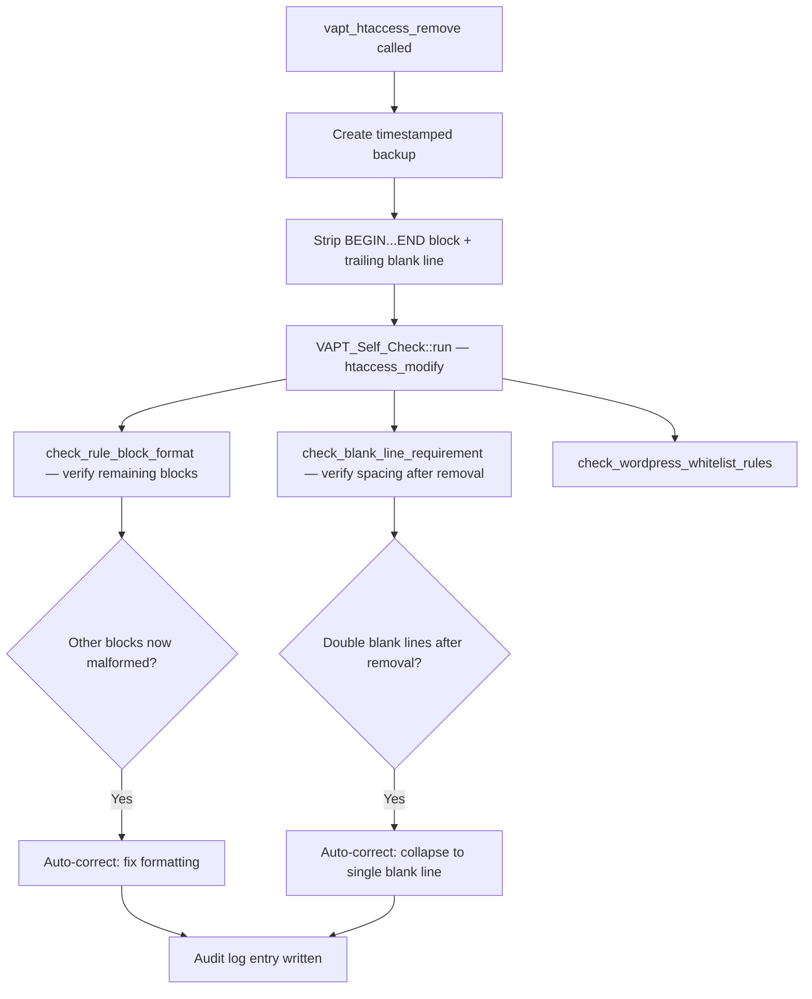
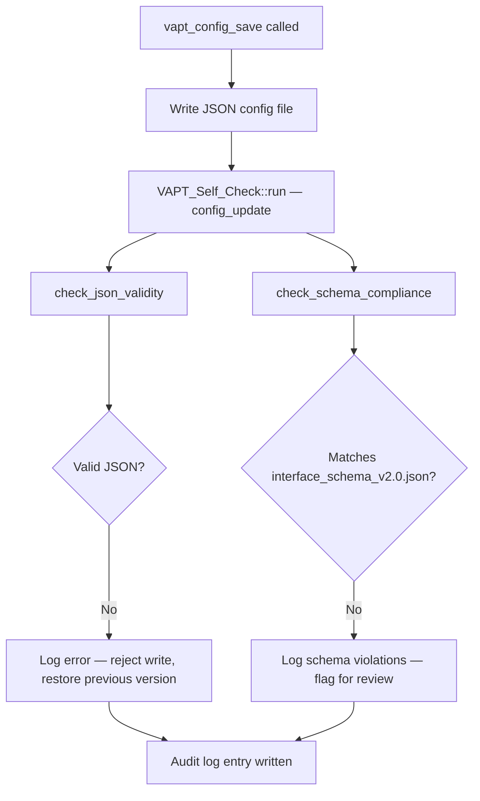
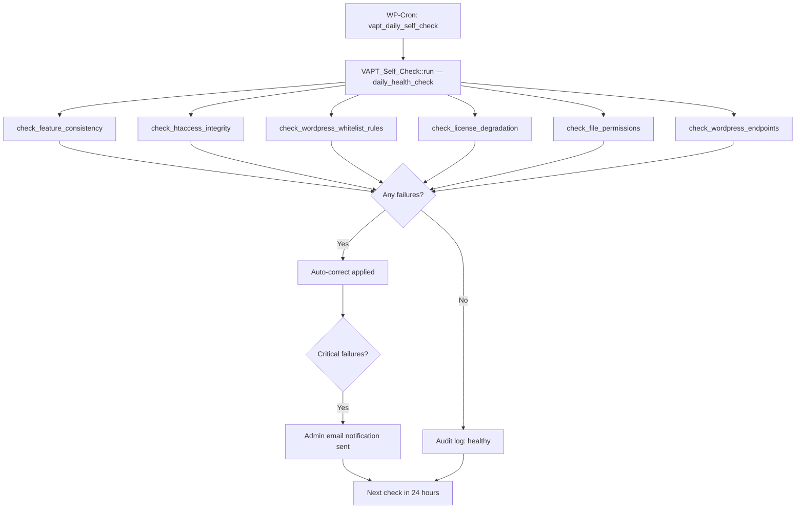
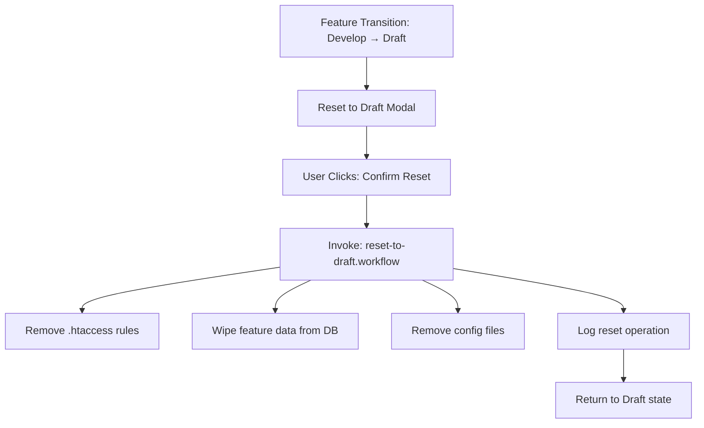

# Universal AI Configuration Ruleset

> **VAPTSecure Plugin - AI Configuration Standard**
> Version: 2.0.0
> Last Updated: March 2026

---

## 🎯 Overview

This `.ai/` directory implements the **Universal AI Configuration Ruleset** — a cross-editor compatible configuration system that unifies AI agent behavior across all editors, IDEs, and AI coding extensions.

The **single source of truth** is `.ai/SOUL.md`. Every supported editor and extension points to this file via a symlink or stub file, so updating SOUL.md propagates instantly everywhere.

---

## 📋 Supported Editors & Extensions

| # | Editor / Extension | Platform | Config Path | Config Type |
|---|-------------------|----------|-------------|-------------|
| 1 | **Cursor** | VS Code fork | `.cursor/cursor.rules` | Rules file |
| 2 | **Windsurf** | VS Code fork | `.windsurfrules` | Rules file |
| 3 | **Zed** | Standalone (Rust) | `.rules` | Rules file |
| 4 | **Gemini / Antigravity** | VS Code ext | `.gemini/gemini.md` | Rules file |
| 5 | **Claude Code** | CLI / VS Code ext | `.claude/settings.json` | Settings JSON |
| 6 | **Qoder** | VS Code ext | `.qoder/qoder.rules` | Rules file |
| 7 | **Trae** | VS Code ext | `.trae/trae.rules` | Rules file |
| 8 | **Kilo Code** | VS Code ext | `.kilocode/rules/soul.md` | Rules directory |
| 9 | **Continue** | VS Code / JetBrains ext | `.continue/rules/soul.md` | Rules directory |
| 10 | **Roo Code** | VS Code ext | `.roo/rules/soul.md` + `.roorules` | Rules directory + fallback |
| 11 | **GitHub Copilot** | VS Code / JetBrains / Visual Studio | `.github/copilot-instructions.md` | Instructions file |
| 12 | **JetBrains Junie** | IntelliJ / PyCharm / WebStorm / GoLand / PhpStorm | `.junie/guidelines.md` | Guidelines file |
| 13 | **VS Code** (native) | Standalone | `.vscode/settings.json` | Editor settings only |

---

## 📁 Directory Structure

```
.ai/
├── README.md                         # This documentation
├── SOUL.md                           # Universal rules (single source of truth)
├── AGENTS.md                         # Multi-agent orchestration guide
├── skills/                           # Portable Agent Skills
│   ├── vapt-expert/SKILL.md         # VAPT Security Expert skill
│   └── security-auditor/SKILL.md    # Security Audit skill
├── workflows/                        # Reusable workflows
│   ├── security-scan.yml
│   ├── reset-to-draft.yml
│   └── validation.yml
└── rules/                            # Editor-specific rule symlinks
    ├── cursor.rules  → ../SOUL.md
    ├── gemini.md     → ../SOUL.md
    ├── kilo.rules    → ../SOUL.md
    └── roo.rules     → ../SOUL.md
```

---

## 🔗 Editor-Specific Symlinks

All symlinks point back to `.ai/SOUL.md` as the single source of truth. Instructions for creating each symlink are provided per editor.

---

### 1. Cursor Editor (`.cursor/`)

```
.cursor/
├── skills/       → ../../.ai/skills/
└── cursor.rules  → ../.ai/rules/cursor.rules
```

**Setup:**
```bash
mkdir -p .cursor
ln -s ../.ai/rules/cursor.rules .cursor/cursor.rules
ln -s ../../.ai/skills .cursor/skills
```

**Quick Start:**
1. The `.cursor/` directory symlinks to `.ai/skills/`
2. Edit rules in `.ai/SOUL.md` — changes apply everywhere
3. Use `@vapt-expert` to invoke the VAPT expert skill

---

### 2. Windsurf (`.windsurf/` + `.windsurfrules`)

```
.windsurf/
└── skills/       → ../../.ai/skills/
.windsurfrules    → .ai/SOUL.md
```

**Setup:**
```bash
mkdir -p .windsurf
ln -s .ai/SOUL.md .windsurfrules
ln -s ../../.ai/skills .windsurf/skills
```

**Quick Start:**
1. Windsurf loads `.windsurfrules` automatically from the project root
2. The symlink ensures Windsurf always reads the current SOUL.md

---

### 3. Zed Editor (`.zed/` + `.rules`)

```
.zed/
└── settings.json     ← model/provider config (not symlinked)
.rules                → .ai/SOUL.md    ← Zed priority-1 rule file
```

**Setup:**
```bash
ln -s .ai/SOUL.md .rules
```

**Quick Start:**
1. Zed scans the project root for rule files in this priority order: `.rules` → `.cursorrules` → `.windsurfrules` → `AGENTS.md`
2. Only the **first matching file** is loaded — `.rules` is checked first
3. The symlink from `.rules → .ai/SOUL.md` ensures Zed always gets the latest rules
4. Configure the AI model in `.zed/settings.json` (this file is NOT symlinked):

```json
{
    "agent": {
        "default_model": {
            "provider": "anthropic",
            "model": "claude-sonnet-4-6"
        }
    }
}
```

> **Note:** Zed's Rules Library (accessed via `...` → `Rules...` in the Agent Panel) can store additional named rules. These complement — but do not replace — the project-root `.rules` file.

---

### 4. Gemini / Antigravity (`.gemini/`)

```
.gemini/
├── antigravity/
│   └── skills/   → ../../../.ai/skills/
└── gemini.md     → ../.ai/rules/gemini.md
```

**Setup:**
```bash
mkdir -p .gemini/antigravity
ln -s ../.ai/rules/gemini.md .gemini/gemini.md
ln -s ../../../.ai/skills .gemini/antigravity/skills
```

**Quick Start:**
1. Use `--expert vapt` flag to load the VAPT expert
2. Skills are automatically available under `.gemini/antigravity/skills/`

---

### 5. Claude Code (`.claude/`)

```
.claude/
├── skills/       → ../../.ai/skills/
└── settings.json → ../.ai/rules/claude-settings.json
```

**Setup:**
```bash
mkdir -p .claude
ln -s ../.ai/rules/claude-settings.json .claude/settings.json
ln -s ../../.ai/skills .claude/skills
```

**Quick Start:**
1. Skills are automatically available in Claude Code
2. The settings.json symlink loads SOUL.md context at startup

---

### 6. Qoder (`.qoder/`)

```
.qoder/
├── skills/       → ../../.ai/skills/
└── qoder.rules   → ../.ai/SOUL.md
```

**Setup:**
```bash
mkdir -p .qoder
ln -s ../.ai/SOUL.md .qoder/qoder.rules
ln -s ../../.ai/skills .qoder/skills
```

---

### 7. Trae (`.trae/`)

```
.trae/
├── skills/       → ../../.ai/skills/
└── trae.rules    → ../.ai/SOUL.md
```

**Setup:**
```bash
mkdir -p .trae
ln -s ../.ai/SOUL.md .trae/trae.rules
ln -s ../../.ai/skills .trae/skills
```

---

### 8. Kilo Code (`.kilocode/`)

```
.kilocode/
└── rules/
    └── soul.md   → ../../.ai/SOUL.md
```

**Setup:**
```bash
mkdir -p .kilocode/rules
ln -s ../../.ai/SOUL.md .kilocode/rules/soul.md
```

**How Kilo Code loads rules:**
- Kilo Code scans all `.md` files inside `.kilocode/rules/` and loads them all
- The symlinked `soul.md` points to SOUL.md, so the full ruleset is always current
- Mode-specific rules can be added in `.kilocode/rules-{mode}/` subdirectories (e.g., `.kilocode/rules-code/`)

**Quick Start:**
1. Open the project in VS Code with Kilo Code installed
2. The SOUL.md rules load automatically for every Kilo Code session
3. Use the Kilo Code sidebar to start a session — rules are pre-loaded

> **Docs:** [https://kilo.ai/docs](https://kilo.ai/docs)

---

### 9. Continue (`.continue/`)

```
.continue/
└── rules/
    └── soul.md   → ../../.ai/SOUL.md
```

**Setup:**
```bash
mkdir -p .continue/rules
ln -s ../../.ai/SOUL.md .continue/rules/soul.md
```

**How Continue loads rules:**
- Continue loads all `.md` files from `.continue/rules/` as project-level rules
- Rules are injected into the system prompt for all Agent, Chat, and Edit requests
- Global config lives at `~/.continue/config.yaml` — the project rules directory is additive

**config.yaml project rules reference (optional, for explicit loading):**
```yaml
# ~/.continue/config.yaml  — or project-level .continue/config.yaml
name: VAPTSecure Config
version: 1.0.0
schema: v1
rules:
  - .continue/rules/soul.md
```

**Quick Start:**
1. Open the project in VS Code or JetBrains with Continue installed
2. Press `Cmd/Ctrl + L` to open the Continue sidebar
3. The SOUL.md rules load automatically for Agent and Chat requests
4. Rules are visible in the toolbar pen icon above the chat input

> **Docs:** [https://docs.continue.dev/](https://docs.continue.dev/)

---

### 10. Roo Code (`.roo/` + `.roorules`)

```
.roo/
└── rules/
    └── soul.md   → ../../.ai/SOUL.md   ← primary (directory-based)
.roorules         → .ai/SOUL.md         ← fallback (if .roo/rules/ empty)
```

**Setup:**
```bash
mkdir -p .roo/rules
ln -s ../../.ai/SOUL.md .roo/rules/soul.md
ln -s .ai/SOUL.md .roorules
```

**How Roo Code loads rules:**
- **Primary**: Roo Code loads all `.md` files from `.roo/rules/` (generic, all modes)
- **Mode-specific**: Place rules in `.roo/rules-{modeSlug}/` (e.g., `.roo/rules-code/`) to scope to a mode
- **Fallback**: If `.roo/rules/` is empty or absent, Roo Code falls back to `.roorules`
- Both the directory and fallback file are symlinked here, so the fallback also stays current

**Mode-specific symlink example (optional):**
```bash
mkdir -p .roo/rules-code
ln -s ../../../.ai/SOUL.md .roo/rules-code/soul.md
```

**Quick Start:**
1. Open the project in VS Code with Roo Code installed
2. Rules load automatically for all modes
3. Use `@` to invoke the VAPT expert skill from `.ai/skills/vapt-expert/`

> **Docs:** [https://docs.roocode.com/features/custom-instructions](https://docs.roocode.com/features/custom-instructions)

---

### 11. GitHub Copilot (`.github/`)

```
.github/
└── copilot-instructions.md → ../.ai/SOUL.md
```

**Setup:**
```bash
mkdir -p .github
ln -s ../.ai/SOUL.md .github/copilot-instructions.md
```

**How GitHub Copilot loads instructions:**
- VS Code, Visual Studio, and JetBrains IDEs automatically detect `.github/copilot-instructions.md`
- Instructions are silently injected into every Copilot Chat request
- Verify via the **References** section in any Copilot Chat response
- Path-specific instructions can be layered on top in `.github/instructions/*.instructions.md`

**Path-specific instruction example (optional):**
```bash
mkdir -p .github/instructions
# Create a security-specific instruction file
cat > .github/instructions/security.instructions.md << 'EOF'
---
applyTo: "**/*.php,**/.htaccess,**/wp-config.php"
---
# Security context for PHP and WordPress config files
Always follow the VAPT security rules defined in .github/copilot-instructions.md.
Never suggest hardcoded credentials or insecure PHP patterns.
EOF
```

**Quick Start:**
1. Works automatically in VS Code, Visual Studio, and all JetBrains IDEs (IntelliJ, PyCharm, WebStorm, GoLand, PhpStorm, etc.)
2. No additional configuration required — instructions load on every Copilot Chat interaction
3. Ensure the setting `github.copilot.chat.codeGeneration.useInstructionFiles` is enabled (default: on)

> **Docs:** [https://docs.github.com/copilot/customizing-copilot/adding-custom-instructions-for-github-copilot](https://docs.github.com/copilot/customizing-copilot/adding-custom-instructions-for-github-copilot)

---

### 12. JetBrains Junie (`.junie/`)

Junie is JetBrains' autonomous AI coding agent, available in IntelliJ IDEA, PyCharm, WebStorm, GoLand, PhpStorm, RubyMine, RustRover, and Rider.

```
.junie/
└── guidelines.md → ../.ai/SOUL.md
```

**Setup:**
```bash
mkdir -p .junie
ln -s ../.ai/SOUL.md .junie/guidelines.md
```

**How Junie loads guidelines:**
- Junie reads `.junie/guidelines.md` at project open and injects it into every task
- Guidelines persist across sessions without re-prompting
- Alternatively, Junie also reads `AGENTS.md` at the project root (standard open format)
- Custom path: configurable at `Settings | Tools | Junie | Project Settings → Guidelines path`

**AGENTS.md fallback (optional — already in your project):**
```bash
# If you already have AGENTS.md, Junie will use that automatically.
# To explicitly point Junie at SOUL.md, use .junie/guidelines.md (above).
```

**Quick Start:**
1. Open the project in any JetBrains IDE with Junie enabled
2. Junie automatically reads `.junie/guidelines.md` on first task
3. Access Junie via the **Junie** tool window (right sidebar)
4. The full VAPTSecure security rules and self-check context are always injected

> **Docs:** [https://www.jetbrains.com/help/junie/customize-guidelines.html](https://www.jetbrains.com/help/junie/customize-guidelines.html)

---

### 13. VS Code Native (`.vscode/`)

```
.vscode/
└── settings.json     ← editor settings only (no symlink to SOUL.md)
```

VS Code's native AI features (GitHub Copilot) use `.github/copilot-instructions.md` (see entry 11 above). The `.vscode/settings.json` file handles only editor settings.

```json
{
    "editor.formatOnSave": true,
    "editor.tabSize": 4,
    "github.copilot.chat.codeGeneration.useInstructionFiles": true
}
```

---

## 🚀 Quick Setup — All Editors at Once

Run this script from the project root to create all symlinks in one step:

```bash
#!/bin/bash
# setup-ai-symlinks.sh — Create all editor symlinks pointing to .ai/SOUL.md

set -e

echo "🔗 Setting up AI configuration symlinks for VAPTSecure..."

# ── VS Code fork editors ──────────────────────────────────────────────────────
mkdir -p .cursor
ln -sf ../.ai/rules/cursor.rules .cursor/cursor.rules
ln -sf ../../.ai/skills .cursor/skills
echo "  ✅ Cursor"

mkdir -p .windsurf
ln -sf .ai/SOUL.md .windsurfrules
ln -sf ../../.ai/skills .windsurf/skills
echo "  ✅ Windsurf"

# ── Standalone editors ────────────────────────────────────────────────────────
ln -sf .ai/SOUL.md .rules
echo "  ✅ Zed (.rules)"

# ── VS Code extensions ────────────────────────────────────────────────────────
mkdir -p .gemini/antigravity
ln -sf ../.ai/rules/gemini.md .gemini/gemini.md
ln -sf ../../../.ai/skills .gemini/antigravity/skills
echo "  ✅ Gemini / Antigravity"

mkdir -p .claude
ln -sf ../.ai/rules/claude-settings.json .claude/settings.json
ln -sf ../../.ai/skills .claude/skills
echo "  ✅ Claude Code"

mkdir -p .qoder
ln -sf ../.ai/SOUL.md .qoder/qoder.rules
ln -sf ../../.ai/skills .qoder/skills
echo "  ✅ Qoder"

mkdir -p .trae
ln -sf ../.ai/SOUL.md .trae/trae.rules
ln -sf ../../.ai/skills .trae/skills
echo "  ✅ Trae"

mkdir -p .kilocode/rules
ln -sf ../../.ai/SOUL.md .kilocode/rules/soul.md
echo "  ✅ Kilo Code"

mkdir -p .continue/rules
ln -sf ../../.ai/SOUL.md .continue/rules/soul.md
echo "  ✅ Continue"

mkdir -p .roo/rules
ln -sf ../../.ai/SOUL.md .roo/rules/soul.md
ln -sf .ai/SOUL.md .roorules
echo "  ✅ Roo Code"

# ── Cross-IDE ─────────────────────────────────────────────────────────────────
mkdir -p .github
ln -sf ../.ai/SOUL.md .github/copilot-instructions.md
echo "  ✅ GitHub Copilot"

mkdir -p .junie
ln -sf ../.ai/SOUL.md .junie/guidelines.md
echo "  ✅ JetBrains Junie"

echo ""
echo "✅ All symlinks created. SOUL.md is now active in 12 editors/extensions."
echo "   Edit .ai/SOUL.md once — all tools update automatically."
```

---

## 🔄 Self-Check Automation System

The VAPTSecure plugin includes a fully autonomous self-check engine that validates system integrity and applies corrective actions **without manual intervention**. It fires automatically on every critical lifecycle event.

### How It Works

```
Trigger Event
     │
     ▼
VAPT_Self_Check::run($event, $context)
     │
     ├── Always: check_htaccess_integrity()
     ├── Always: check_wordpress_endpoints()
     ├── Always: check_file_permissions()
     │
     └── Event-specific checks (see table below)
               │
               ▼
         VAPT_Self_Check_Result
               │
               ├── Auto-correct (if vapt_auto_correct = true)
               │         └── VAPT_Auto_Correct::apply($corrections)
               │
               └── VAPT_Audit_Log::log_check($trigger, $result)
                         └── notify_admin() if critical failures
```

---

### Trigger Events & What Each One Does

#### 🔴 Plugin Deactivated (`plugin_deactivate`) — CRITICAL

Fires via `register_deactivation_hook()` the moment the plugin is toggled off in **Plugins > Installed Plugins**.



**Data preserved** — feature definitions and audit history are kept so the plugin can resume cleanly on reactivation. Only `.htaccess` rules are stripped.

---

#### 🔴 Plugin Removed from Site (`plugin_uninstall`) — CRITICAL

Fires via `register_uninstall_hook()` when the admin clicks **Delete** after deactivation.



**Full wipe** — no data is preserved. The site is returned to the exact state it was in before the plugin was ever installed.

---

#### 🟠 License Expires (`license_expire`) — HIGH

Fires via the `vapt_license_check` WP-Cron event (runs every 12 hours) when `vapt_license_expiry` timestamp is in the past.



---

#### 🟠 Feature Enabled (`feature_enable`) — HIGH

Fires via `do_action('vapt_feature_enabled', $feature_id)` when a feature transitions from Draft/Develop → Deploy.



---

#### 🟠 Feature Disabled (`feature_disable`) — HIGH

Fires via `do_action('vapt_feature_disabled', $feature_id)` when a feature is toggled off or Reset to Draft.



---

#### 🟡 `.htaccess` Rule Added (`htaccess_modify`) — MEDIUM

Fires every time `vapt_htaccess_write()` is called to add or update a rule block.



**Blank line contract — enforced on every write:**

```
# BEGIN VAPT-RISK-{FEATURE-ID}        ← marker
<IfModule mod_rewrite.c>
    RewriteEngine On
    RewriteCond ...
    RewriteRule ...
                                       ← ✅ EXACTLY ONE blank line here
</IfModule>
                                       ← ✅ (content ends, one blank line before END)
# END VAPT-RISK-{FEATURE-ID}          ← marker
                                       ← ✅ EXACTLY ONE blank line here (between blocks)
# BEGIN VAPT-RISK-NEXT-FEATURE        ← next block
```

| Violation | Auto-Correct Action |
|-----------|-------------------|
| No blank line before END | Appends `\n` to make `\n\n` |
| Two+ blank lines before END | Collapses to exactly `\n\n` |
| No blank line after END | Appends `\n` after END marker |
| Trailing whitespace on last rule line | `rtrim()` applied |
| Multiple blank lines inside block | Collapses consecutive `\n\n\n+` to `\n\n` |

---

#### 🟡 `.htaccess` Rule Removed (`htaccess_modify`) — MEDIUM

Fires every time `vapt_htaccess_remove()` is called to strip a feature's rule block.



---

#### 🟡 Config File Updated (`config_update`) — MEDIUM

Fires via `vapt_config_save()` when any JSON config in `/data/generated/` is written.



---

#### 🟢 Daily Health Check (`daily_health_check`) — LOW

Fires every 24 hours via the `vapt_daily_self_check` WP-Cron event. Runs a broad sweep across all subsystems.



---

#### ⚪ Manual Diagnostics (`manual_trigger`) — ON-DEMAND

Triggered by clicking **"Run Diagnostics Now"** on the VAPTSecure Diagnostics admin page at `https://{domain}/wp-admin/admin.php?page=vaptsecure-diagnostics`.

Runs all checks. Results display immediately on-screen with pass/warn/fail indicators. All corrections are applied and logged.

---

### Self-Check Results Reference

| Check ID | Trigger(s) | What It Validates |
|----------|-----------|-------------------|
| `htaccess_integrity` | All | Orphaned BEGIN/END markers, blank line before END |
| `wordpress_endpoints` | All | WP admin, login, REST API, admin-ajax all return non-blocking HTTP codes |
| `file_permissions` | All | wp-config.php ≤ 0640, .htaccess = 0644, no world-writable uploads |
| `rule_block_format` | `feature_*`, `htaccess_modify` | Exactly one blank line before END, no trailing whitespace |
| `blank_line_requirement` | `htaccess_modify` | One blank line before END, one after END (between blocks) |
| `rewrite_syntax` | `htaccess_modify` | RewriteEngine On present, no bare [OR] on last RewriteCond, no forbidden directives |
| `wordpress_whitelist_rules` | `htaccess_modify`, `daily` | All deny/redirect blocks have WP core whitelist header |
| `feature_consistency` | `feature_*`, `daily` | DB status, wp_options, and .htaccess blocks all agree |
| `cleanup_required` | `plugin_deactivate` | No active features or VAPT .htaccess blocks remain |
| `htaccess_rules_removal` | `plugin_deactivate` | All VAPT blocks stripped from .htaccess |
| `complete_cleanup` | `plugin_uninstall` | Tables, options, generated files, and .htaccess all cleaned |
| `database_tables` | `plugin_activate`, `plugin_uninstall` | Required tables exist (activate) / are gone (uninstall) |
| `license_degradation` | `license_expire` | Premium features disabled, no active premium .htaccess rules |
| `feature_deactivation` | `license_expire` | All premium feature rules removed, states updated |
| `json_validity` | `config_update` | Config file is valid JSON |
| `schema_compliance` | `config_update` | Config matches `interface_schema_v2.0.json` |

---

### Manual Self-Check Trigger (PHP)

```php
// Run all checks manually from any PHP context
$result = VAPT_Self_Check::run('manual_trigger', [
    'requested_by' => get_current_user_id(),
    'checks'       => ['all'],
]);

echo 'Status: '   . $result->get_overall_status()  . "\n";
echo 'Passed: '   . $result->get_passed_count()    . "\n";
echo 'Failed: '   . $result->get_failed_count()    . "\n";
echo 'Warnings: ' . $result->get_warning_count()   . "\n";

if ( $result->has_failures() ) {
    foreach ( $result->get_failures() as $item ) {
        echo "FAIL [{$item->check_id}]: {$item->message}\n";
    }
}
```

---

## 📋 Workflow Integration

### Trigger: Reset to Draft

When a Feature transitions from **Develop → Draft** and the user clicks **"Confirm Reset (Wipe Data)"**:



Actions performed:
1. **Remove `.htaccess`/config rules** added during deployment
2. **Wipe feature-specific data** from WordPress database
3. **Remove generated config files** for this feature
4. **Log the reset operation** in `vapt_feature_history@Draft`
5. **Update feature state** to Draft

See `.ai/workflows/reset-to-draft.yml` for the automated workflow definition.

---

## 🔧 Skill Development

### Adding a New Skill

1. Create skill directory: `.ai/skills/your-skill/`
2. Add `SKILL.md` with proper metadata header
3. Update `.ai/AGENTS.md` with orchestration rules
4. Test across editors

### Skill Metadata Format

```yaml
---
name: Skill Name
description: What this skill does
version: "1.0.0"
triggers: ["@skill-name", "keyword"]
editors: [cursor, claude, gemini, kilo, continue, roo, copilot, junie, zed]
---
```

---

## 📝 Configuration Rules

### Universal Rules (SOUL.md)
- **Location**: `.ai/SOUL.md`
- **Purpose**: Cross-editor behavior definition
- **Applies To**: All AI agents regardless of editor

### Editor-Specific Rules
- **Location**: `.ai/rules/*.md`
- **Purpose**: Editor-specific optimizations
- **Type**: Symlinks to SOUL.md

### Agent Orchestration (AGENTS.md)
- **Location**: `.ai/AGENTS.md`
- **Purpose**: Multi-agent collaboration rules
- **Scope**: Complex workflows requiring multiple agents

---

## 🛡️ Security Considerations

1. **Never commit API keys** to this repository
2. **Use environment-specific configs** outside version control
3. **All `.htaccess` rules** must include WordPress whitelist paths
4. **Validate all file operations** before execution
5. **`{domain}` placeholder only** — never hardcode hostnames in generated configs

---

## 🤝 Contributing

When modifying this configuration:
1. Edit `.ai/SOUL.md` for universal rules — all editors update automatically
2. Update `.ai/AGENTS.md` for orchestration changes
3. Test in multiple editors before committing
4. Document new workflows in this README

---

## �️ Maintenance Tools

### **Automated Verification**
```bash
# Verify all AI configurations
php tools/verify-ai-config.php

# Includes editor optimization hints and performance tips
```

### **Automated Setup**
```bash
# Linux/Mac - automatically creates all symlinks
./tools/setup-ai-config.sh

# Windows PowerShell - automatically creates all symlinks
.\tools\setup-ai-config.ps1
```

### **Performance Optimization**
- 📖 **Editor Optimization Guide**: `.ai/EDITOR_OPTIMIZATION_GUIDE.md`
- 🎯 **Performance Tips**: Model recommendations, context windows, loading optimization
- 📊 **Configuration Scoring**: Automated 100-point scoring system

---

## 📚 Resources

| Reference | Link |
|-----------|------|
| VAPTSecure Plugin Documentation | `../README.md` |
| Feature Lifecycle Workflow | `../.agent/workflows/transition-to-develop.md` |
| VAPTSchema Builder Skill | `skills/vapt-expert/SKILL.md` |
| Kilo Code Documentation | [https://kilo.ai/docs](https://kilo.ai/docs) |
| Kilo Code Custom Rules Guide | [https://blog.kilo.ai/p/extending-kilo-code-ai-with-custom](https://blog.kilo.ai/p/extending-kilo-code-ai-with-custom) |
| Continue Documentation | [https://docs.continue.dev/](https://docs.continue.dev/) |
| Continue Rules Deep-Dive | [https://docs.continue.dev/customize/deep-dives/rules](https://docs.continue.dev/customize/deep-dives/rules) |
| Roo Code Documentation | [https://docs.roocode.com/](https://docs.roocode.com/) |
| Roo Code Custom Instructions | [https://docs.roocode.com/features/custom-instructions](https://docs.roocode.com/features/custom-instructions) |
| GitHub Copilot Custom Instructions | [https://docs.github.com/copilot/customizing-copilot/adding-custom-instructions-for-github-copilot](https://docs.github.com/copilot/customizing-copilot/adding-custom-instructions-for-github-copilot) |
| JetBrains Junie Guidelines | [https://www.jetbrains.com/help/junie/customize-guidelines.html](https://www.jetbrains.com/help/junie/customize-guidelines.html) |
| JetBrains Junie Guidelines Catalog | [https://github.com/JetBrains/junie-guidelines](https://github.com/JetBrains/junie-guidelines) |
| Zed AI Rules Documentation | [https://zed.dev/docs/ai/rules](https://zed.dev/docs/ai/rules) |
| Zed Agent Panel | [https://zed.dev/docs/ai/agent-panel](https://zed.dev/docs/ai/agent-panel) |

---

*Generated for VAPTSecure WordPress Plugin v2.4.11*
*Universal AI Configuration Ruleset v2.0.0 | Last Updated: March 2026*
