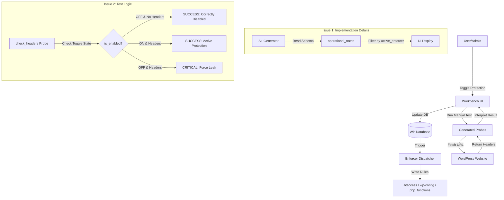

# Implementation Plan - Global Implementation Fixes (Risk-012 & Discrepancy Correction)

This plan addresses two issues reported in the Risk-012 implementation:
1.  **Implementation Details Display**: The "Implementation Details" section in the Business Impact area incorrectly lists all compatible enforcers instead of only the active one.
2.  **Manual Test Messages**: The header verification test returns "FAILURE" (Unprotected) when the protection toggle is OFF, even if it's correctly disabled. It should report "SUCCESS" for correctly disabled protection.

## System Overview & Information Flow

## User Review Required

> [!IMPORTANT]
> This fix is applied in a **Global Context**. It ensures that throughout the entire VAPT Secure Workbench, the "Success" status of a verification test is intelligently tied to the user's intent (the toggle state). Turning OFF protection and verifying it is inactive will now correctly report a "SUCCESS".

## Proposed Changes

### 1. Unified A+ Adaptive Generator (`aplus-generator.js`)

Refine the "Implementation Details" generation to be strictly relevant to the active environment and user selection.

#### [MODIFY] `aplus-generator.js`

*   **Logic Enhancement**: Update `operational_notes` to filter `platform_implementations` more strictly.
*   **Active Enforcer Priority**: If `active_enforcer` is set, ONLY display that enforcer.
*   **Environment Awareness**: If no enforcer is selected, use `window.vaptEnvironmentProfile` to show only the enforcer compatible with the current server (e.g., only show `.htaccess` and `PHP Functions` on Apache).
*   **Fallback**: If no compatible enforcers are found or environment is unknown, show a concise summary without listing irrelevant systems like IIS or Caddy on a Linux server.

### 2. Global Probe Registry (`generated-interface.js`)

Normalize the SUCCESS/FAILURE conditions across all verification probes to align with the "Enforce Protection" toggle state.

#### [MODIFY] `generated-interface.js`

Apply the following "State-Aware Success" logic to all probes in `PROBE_REGISTRY`:

| Feature Toggle | Server Enforcement | Resulting Message | Status |
| :--- | :--- | :--- | :--- |
| **ON** | **Detected** | "Plugin is actively enforcing protection." | **SUCCESS** |
| **ON** | **Not Detected** | "Protection toggle is ON but server is NOT enforcing." | **FAILURE** |
| **OFF** | **Detected** | "Warning: Toggle is OFF but server is STILL enforcing." | **FAILURE** |
| **OFF** | **Not Detected** | "Protection correctly disabled. No enforcement detected." | **SUCCESS** |

**Probes to be updated:**
*   `check_headers`: Already has partial logic, needs refinement for multi-header tests.
*   `spam_requests`: Update rate-limit spike test to honor disabled state.
*   `block_xmlrpc`: Update 403 vs 200 checks to honor disabled state.
*   `disable_directory_browsing`: Update 403 vs 200 checks for uploads directory.
*   `block_null_byte_injection`: Update 400 vs 200 checks for param injection.
*   `universal_probe`: The most critical update—ensure all dynamic status checks are state-aware.

## Verification Plan

### Automated Tests
*   Invoke the Workbench for RISK-012 and verify the "Implementation Details" text.
*   Toggle "Enforce Protection" OFF/ON and run the "A+ Header Verification" test for each state via the browser.

### Manual Verification
1.  **Check Implementation Details**:
    *   Navigate to Risk-012 in the Workbench.
    *   Observe the "Implementation Details" in the Business Impact section.
    *   Verify it only lists the active enforcer (e.g., `.htaccess` if on Apache/LiteSpeed).
2.  **Toggle Test (Enforce Protection OFF)**:
    *   Ensure "Enforce Protection" is OFF.
    *   Run the "A+ Header Verification" test.
    *   Expected: "SUCCESS: Protection correctly disabled" (or similar positive message).
3.  **Toggle Test (Enforce Protection ON)**:
    *   Ensure "Enforce Protection" is ON.
    *   Run the "A+ Header Verification" test.
    *   Expected: "SUCCESS: Plugin is actively enforcing headers".

---

## Revision History

### 20260321_@1255 - Initial Plan (Global Context)
- Plan created to address Risk-012 "Implementation Details" display bug and manual test message discrepancy.
- Scope expanded to cover **all probes** in `generated-interface.js` (global context fix per user requirement).
- Added "State-Aware Success" truth table for consistent toggle-aware verification across all enforcer types.
