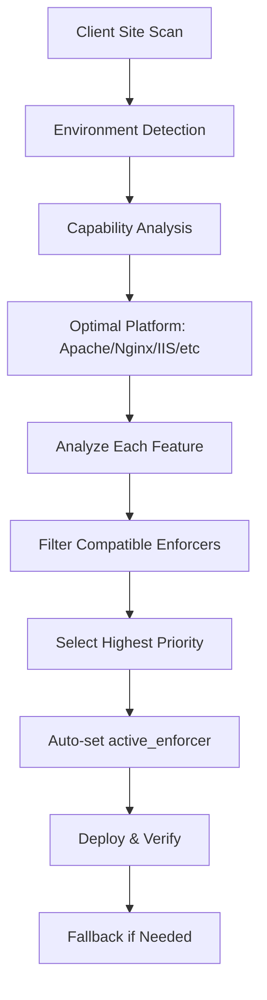

## Analysis of Enforcer Column Implementation

I've conducted a thorough analysis of the VAPTSecure plugin's Enforcer column implementation and the dynamic enforcer selection system. Here are my key findings:

### Current State Assessment

**✅ Strengths:**

1. **Complete Risk Coverage**: All 125 risks in `interface_schema_v2.0.json` have corresponding patterns in `enforcer_pattern_library_v2.0.json`
2. **Multi-Platform Support**: Each risk supports multiple enforcement platforms (.htaccess, Nginx, IIS, Caddy, Cloudflare, PHP Functions, etc.)
3. **Environment Detection**: Sophisticated `VAPTSECURE_Environment_Detector` class accurately identifies server capabilities
4. **Database Integration**: `active_enforcer` field stores user selections per feature
5. **Dynamic Filtering**: JavaScript `resolveEnforcer()` function filters enforcers based on environment compatibility

**⚠️ Gaps Identified:**

1. **No Automatic Optimal Selection**: While the system detects the `optimal_platform`, it doesn't auto-select it for features
2. **Limited Intelligence**: The Enforcer column shows compatible options but doesn't choose the "best" one for deployment
3. **Inconsistent Naming**: Platform names vary (".htaccess" vs "Apache" vs "Litespeed") causing potential mapping issues
4. **No Fallback Strategy**: If the optimal enforcer isn't available for a feature, there's no clear fallback mechanism
5. **Deployment-Time Decisions**: The system doesn't dynamically choose enforcers when deploying to client sites

### Intelligent Enforcer Selection Plan

To address the requirement for "dynamic population based on the webserver being used" and "intelligent enough to dynamically choose the best according to the Client Website," I propose a 5-phase implementation plan:

#### Phase 1: Enhanced Environment Detection

- Add granular server detection (Apache vs LiteSpeed vs OpenLiteSpeed)
- Detect hosting constraints and permissions
- Identify edge services (Cloudflare, Sucuri)

#### Phase 2: Improved Compatibility Mapping

```javascript
// Enhanced mapping with priority scoring
const enhancedCompatibilityMap = {
  'apache_htaccess': {
    enforcers: ['.htaccess', 'Apache', 'Litespeed'],
    priority: 90, // Effectiveness score
    requirements: ['mod_rewrite', 'AllowOverride']
  }
  // ... other platforms
};
```

#### Phase 3: Automatic Enforcer Selection Algorithm

```javascript
function autoSelectEnforcer(feature, environmentProfile) {
  // 1. Get compatible enforcers
  // 2. Match with optimal platform
  // 3. Select highest priority option
  // 4. Store as active_enforcer
}
```

#### Phase 4: Deployment Intelligence Layer

- Pre-deployment analysis of client environment
- Feature-by-feature enforcer selection
- Validation and fallback planning
- Automated deployment with verification

#### Phase 5: UI/UX Enhancements

- Visual indicators for auto-selected enforcers
- Override capability with audit trail
- Bulk operations for mass deployment
- Deployment preview dashboard

### Workflow Diagram



### Immediate Actions

1. **Update `resolveEnforcer()` function** to auto-select optimal enforcer when `active_enforcer` is null
2. **Enhance compatibility mapping** with priority scores
3. **Add deployment intelligence** to the `VAPTSECURE_Deployment_Orchestrator`
4. **Create admin UI enhancements** showing auto-selection reasoning

### Expected Outcomes

- **Dynamic Enforcer Population**: Enforcer column automatically populated with optimal choices
- **Intelligent Deployment**: System selects best enforcer per feature based on client environment
- **Reduced Manual Configuration**: Less need for manual enforcer selection
- **Improved Protection**: More reliable security implementation across diverse hosting environments

This plan transforms the Enforcer column from a manual selection tool into an intelligent system that dynamically chooses and deploys the optimal protection mechanism for each client's specific hosting environment.
