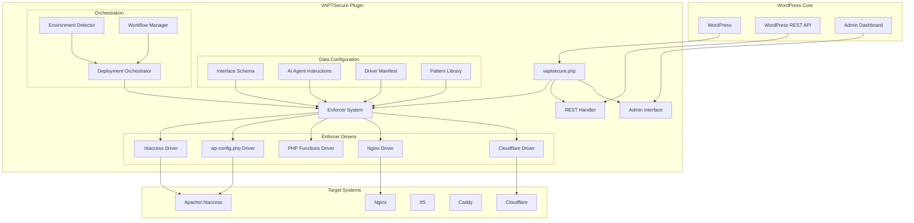

# VAPTSecure WordPress Plugin - Architecture Analysis

## Overview
**VAPTSecure** is a sophisticated WordPress security plugin (version 2.5.9) that implements AI-driven vulnerability assessment and penetration testing (VAPT) for 125 WordPress security risks. The plugin uses a driver-based enforcement system with multi-platform support and comprehensive self-check automation.

## Core Architecture Components

### 1. Plugin Bootstrap & Identity System
**File:** `vaptsecure.php`

**Key Components:**
- **Superadmin Identity System**: Base64-encoded credentials for privileged access
- **Database Schema**: 7 core tables for domains, features, status, meta, history, builds, and security events
- **Activation Hooks**: Automatic table creation and version management
- **Auto-update Mechanism**: Version checking and update notifications

**Database Tables:**
1. `wp_vaptsecure_domains` - Multi-site domain tracking
2. `wp_vaptsecure_features` - 125 security risk definitions
3. `wp_vaptsecure_feature_status` - Feature lifecycle states
4. `wp_vaptsecure_feature_meta` - Implementation metadata
5. `wp_vaptsecure_feature_history` - State transition history
6. `wp_vaptsecure_builds` - Deployment builds
7. `wp_vaptsecure_security_events` - Security event logging

### 2. Core Class Structure
**Location:** `includes/`

**Primary Classes:**
- **VAPTSECURE_Enforcer** - Central enforcement dispatcher with caching and global toggle
- **VAPTSECURE_Admin** - WordPress admin interface with React-based UI
- **VAPTSECURE_REST** - Comprehensive REST API with 20+ endpoints
- **VAPTSECURE_Workflow** - State machine for feature lifecycle management
- **VAPTSECURE_Deployment_Orchestrator** - Multi-platform deployment coordination
- **VAPTSECURE_Environment_Detector** - Server environment detection
- **VAPTSECURE_License_Manager** - License validation and management
- **VAPTSECURE_Auth** - Authentication and authorization
- **VAPTSECURE_DB** - Database abstraction layer
- **VAPTSECURE_Build** - Build management system

### 3. Data Configuration System
**Location:** `data/`

**Configuration Files:**
1. **`interface_schema_v2.0.json`** - UI component definitions for all 125 risks
2. **`ai_agent_instructions_v2.0.json`** - AI agent system prompts and task definitions
3. **`vapt_driver_manifest_v2.0.json`** - Machine-executable driver instructions
4. **`enforcer_pattern_library_v2.0.json`** - Security patterns for all enforcer types
5. **`VAPT_Driver_Reference_v2.0.php`** - PHP reference implementation

**Key Features:**
- JSON schema validation system
- AI agent integration with file reading order
- Multi-platform support (Apache, Nginx, IIS, Caddy, Cloudflare)
- Self-check rubric with 19-point validation

### 4. AI Agent Integration
**Location:** `.ai/` and symlinked to all editor configurations

**Universal Configuration:**
- **`SOUL.md`** - Single source of truth for all AI agents
- Symlinked to 13+ editors/extensions (Cursor, Gemini, Claude, Qoder, Trae, Windsurf, Kilo Code, Continue, Roo Code, GitHub Copilot, JetBrains Junie, Zed, OpenCode)
- Domain placeholder system (`{domain}`) for runtime resolution
- Self-check automation on all lifecycle events

**Self-Check Automation Events:**
- Plugin activation/deactivation/uninstall
- Feature enable/disable
- License expiration
- Daily health checks
- Manual diagnostics

### 5. Enforcer System & Driver Architecture
**Location:** `includes/enforcers/`

**Enforcer Types:**
1. **`.htaccess` Driver** - Apache mod_rewrite rules
2. **`wp-config.php` Driver** - WordPress configuration constants
3. **PHP Functions Driver** - Hook-based PHP code
4. **WordPress Driver** - Action/filter hooks
5. **Nginx Driver** - Nginx configuration directives
6. **Apache Driver** - httpd.conf directives
7. **IIS Driver** - web.config rules
8. **Caddy Driver** - Caddyfile configurations
9. **Cloudflare Driver** - WAF custom rules
10. **fail2ban Driver** - Jail.local configurations

**Driver Contract:**
- Read sequence for file inspection
- Write modes (insert_at_anchor, prepend_to_file, etc.)
- Insertion anchor definitions
- Idempotency checks
- Rollback mechanisms

### 6. Deployment & Orchestration
**Class:** `VAPTSECURE_Deployment_Orchestrator`

**Orchestration Logic:**
- Environment detection (Apache, Nginx, IIS, Caddy)
- Multi-platform deployment coordination
- Profile-based targeting (auto_detect, htaccess_only, etc.)
- Legacy schema compatibility
- Deployment logging and result tracking

**Deployment Profiles:**
- `auto_detect` - Automatic environment detection
- `htaccess_only` - Apache-only deployment
- `nginx_only` - Nginx-only deployment
- `multi_platform` - Cross-platform deployment
- `cloudflare_edge` - Cloudflare WAF rules

### 7. Security Implementation Patterns
**Pattern Library:** `enforcer_pattern_library_v2.0.json`

**Security Categories:**
1. **Configuration Risks** - wp-cron.php, XML-RPC, etc.
2. **Authentication Risks** - Username enumeration, password reset flooding
3. **Information Disclosure** - Directory browsing, file access
4. **Access Control** - Admin protection, REST API guards
5. **File Protection** - Sensitive file blocking, PHP execution restrictions
6. **Security Headers** - XSS protection, frame options, HSTS

**Example Patterns:**
- **RISK-001**: Disable wp-cron.php via wp-config.php constant
- **RISK-002**: Block XML-RPC via .htaccess Files directive
- **RISK-003**: Prevent username enumeration via REST API rewrite rules
- **RISK-004**: Email flooding protection via PHP rate limiting

### 8. WordPress Integration & REST API
**REST API Endpoints:** `vaptsecure/v1/`

**Key Endpoints:**
- `/features` - Get all security features
- `/features/update` - Update feature status
- `/features/transition` - State machine transitions
- `/features/{key}/verify` - Implementation verification
- `/data-files` - Configuration file management
- `/upload-json` - JSON schema upload
- `/reset-limit` - Rate limit reset

**WordPress Integration:**
- Admin menu with React-based interface
- WP-Cron scheduled events for health checks
- WordPress hooks for plugin lifecycle
- Superadmin role-based access control
- Multi-site compatibility

## Architecture Diagram



## Key Architectural Patterns

### 1. Driver-Based Enforcement
- **Abstraction**: Each security risk has multiple platform implementations
- **Idempotency**: Safe re-execution without duplication
- **Rollback**: Clean removal of security rules
- **Verification**: Post-implementation validation

### 2. State Machine Workflow
- **States**: Draft → Develop → Test → Release
- **Transitions**: Controlled state changes with validation
- **History**: Complete audit trail of all changes
- **Reset**: Complete purge back to Draft state

### 3. Multi-Platform Support
- **Apache**: .htaccess and httpd.conf implementations
- **Nginx**: Configuration file directives
- **IIS**: web.config rules
- **Caddy**: Caddyfile configurations
- **Cloudflare**: WAF custom rules
- **fail2ban**: Jail.local configurations

### 4. Self-Check Automation
- **Event-Driven**: Triggers on all lifecycle events
- **Auto-Correction**: Automatic fixing of common issues
- **Audit Logging**: Complete history of all checks
- **Admin Notifications**: Critical issue alerts

### 5. AI Agent Integration
- **Universal Configuration**: Single SOUL.md file for all editors
- **Domain Placeholders**: Runtime domain resolution
- **Pattern Library**: Machine-readable security patterns
- **Validation Rubric**: 19-point quality checklist

## Technical Constraints & Best Practices

### Mandatory Rules:
1. **Never Block Core WordPress Paths**: wp-admin/, wp-json/, admin-ajax.php must remain accessible
2. **.htaccess-Safe Directives Only**: No Directory/Location blocks in .htaccess
3. **Rules Before WordPress Block**: VAPT rules must be placed before # BEGIN WordPress
4. **Module Conditional Wrapping**: All rewrite rules wrapped in <IfModule mod_rewrite.c>
5. **Blank Line Contract**: Exactly one blank line before/after rule blocks
6. **Self-Check on Critical Events**: Automatic validation on all state changes

### Domain Placeholder System:
- **Format**: Always use `{domain}` placeholder
- **Runtime Resolution**: `str_replace('{domain}', get_site_url(), $rules)`
- **FQDN Requirement**: All URLs must be fully qualified with https:// scheme
- **Clickable Links**: Every documentation URL must be valid and clickable

## Deployment Architecture

### Environment Detection:
1. **Server Software Analysis**: Apache, Nginx, IIS, Caddy detection
2. **Configuration File Discovery**: .htaccess, nginx.conf, web.config location
3. **Permission Validation**: Write access verification
4. **Backup Creation**: Pre-deployment backups

### Deployment Profiles:
1. **Auto Detect**: Automatic platform selection
2. **Htaccess Only**: Apache-only deployment
3. **Nginx Only**: Nginx-only deployment
4. **Multi Platform**: Cross-platform deployment
5. **Cloudflare Edge**: Cloudflare WAF rules only

## Security Implementation Examples

### Example 1: XML-RPC Protection (RISK-002)
```apache
# BEGIN VAPT-RISK-002
<Files "xmlrpc.php">
    Order Deny,Allow
    Deny from all
</Files>
# END VAPT-RISK-002
```

### Example 2: Username Enumeration Protection (RISK-003)
```apache
# BEGIN VAPT-RISK-003
<IfModule mod_rewrite.c>
    RewriteEngine On
    RewriteBase /
    RewriteCond %{REQUEST_URI} !/wp-json/wp/v2/users/me [NC]
    RewriteRule ^wp-json/wp/v2/users - [F,L]
</IfModule>
# END VAPT-RISK-003
```

### Example 3: wp-cron.php Disable (RISK-001)
```php
/* BEGIN VAPT RISK-001 */
define('DISABLE_WP_CRON', true);
/* END VAPT RISK-001 */
```

## Conclusion

The VAPTSecure plugin demonstrates a sophisticated, enterprise-grade architecture for WordPress security hardening. Key strengths include:

1. **Comprehensive Coverage**: 125 security risks with multi-platform implementations
2. **Robust Architecture**: Driver-based system with proper abstraction layers
3. **AI Integration**: Universal configuration for AI-assisted development
4. **Self-Healing**: Automated validation and correction
5. **Enterprise Readiness**: Multi-site support, audit logging, and deployment orchestration

The architecture follows WordPress best practices while implementing advanced security patterns suitable for production environments. The plugin's design allows for extensibility while maintaining backward compatibility with existing WordPress installations.

---
**Analysis Date:** March 22, 2026  
**Plugin Version:** 2.5.9  
**Analysis Scope:** Overall architecture and system design  
**Analyst:** Roo (AI Technical Leader)