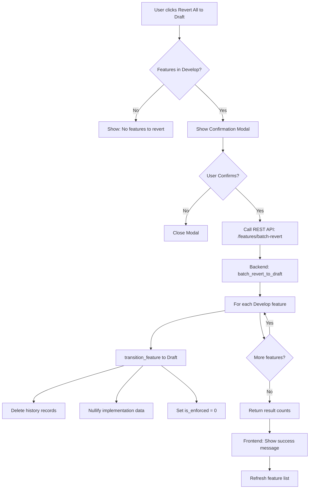
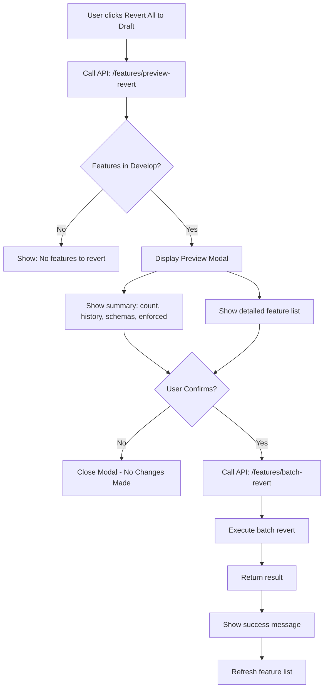

# Plan: Batch Revert "Develop → Draft" Workflow

**Created:** 2026-02-24  
**Status:** Pending Approval

---

## Overview

Create a workflow to revert all features from "Develop" status back to "Draft" status, including removal of all associated history items and implementation data.

---

## Current State Analysis

### Database Tables Involved

| Table | Purpose | Affected Data |
|-------|---------|---------------|
| `vaptsecure_feature_status` | Stores feature status | `status` column: 'Develop' → 'Draft' |
| `vaptsecure_feature_history` | Audit trail of transitions | **DELETE all rows for reverted features** |
| `vaptsecure_feature_meta` | Feature metadata | Nullify: `generated_schema`, `implementation_data`, `is_enforced` |

### Existing Logic (Already Implemented)

The [`VAPTSECURE_Workflow::transition_feature()`](../includes/class-vaptsecure-workflow.php:38) method already handles:

1. Status transition validation (Develop → Draft is allowed per line 27)
2. Wiping history when moving to Draft (lines 82-84)
3. Nullifying implementation data (lines 88-95)

```php
// From class-vaptsecure-workflow.php lines 82-96
if (strtolower($new_status) === 'draft') {
    // 1. Wipe History
    $wpdb->delete($table_history, array('feature_key' => $feature_key));

    // 2. Wipe Implementation Data (Meta)
    $wpdb->update($table_meta, array(
        'generated_schema' => null,
        'implementation_data' => null,
        'override_schema' => null,
        'override_implementation_data' => null,
        'is_enforced' => 0
    ), array('feature_key' => $feature_key));
}
```

---

## Implementation Plan

### Phase 1: Backend - Batch Revert Method

**File:** [`includes/class-vaptsecure-workflow.php`](../includes/class-vaptsecure-workflow.php)

Add new method `batch_revert_to_draft()`:

```php
/**
 * Batch revert all features in 'Develop' status to 'Draft'.
 * 
 * @param string $note Optional note for the operation
 * @return array Result with counts of affected features
 */
public static function batch_revert_to_draft($note = 'Batch revert to Draft')
{
    global $wpdb;
    
    $table_status = $wpdb->prefix . 'vaptsecure_feature_status';
    $table_history = $wpdb->prefix . 'vaptsecure_feature_history';
    $table_meta = $wpdb->prefix . 'vaptsecure_feature_meta';
    
    // 1. Get all features in 'Develop' status
    $develop_features = $wpdb->get_col($wpdb->prepare(
        "SELECT feature_key FROM $table_status WHERE status = %s",
        'Develop'
    ));
    
    if (empty($develop_features)) {
        return array(
            'success' => true,
            'reverted_count' => 0,
            'message' => 'No features in Develop status to revert.'
        );
    }
    
    $reverted = array();
    $errors = array();
    
    foreach ($develop_features as $feature_key) {
        $result = self::transition_feature($feature_key, 'Draft', $note);
        if (is_wp_error($result)) {
            $errors[] = array(
                'feature_key' => $feature_key,
                'error' => $result->get_error_message()
            );
        } else {
            $reverted[] = $feature_key;
        }
    }
    
    return array(
        'success' => empty($errors),
        'reverted_count' => count($reverted),
        'error_count' => count($errors),
        'reverted' => $reverted,
        'errors' => $errors
    );
}
```

---

### Phase 2: Backend - REST API Endpoint

**File:** [`includes/class-vaptsecure-rest.php`](../includes/class-vaptsecure-rest.php)

Add new REST endpoint:

```php
// In register_routes() method:
register_rest_route('vaptsecure/v1', '/features/batch-revert', array(
    'methods'  => 'POST',
    'callback' => array($this, 'batch_revert_to_draft'),
    'permission_callback' => array($this, 'check_permission'),
));

// New callback method:
public function batch_revert_to_draft($request)
{
    $note = $request->get_param('note') ?: 'Batch revert to Draft via Workbench';
    
    $result = VAPTSECURE_Workflow::batch_revert_to_draft($note);
    
    if (!$result['success']) {
        return new WP_REST_Response($result, 207); // Multi-status
    }
    
    return new WP_REST_Response($result, 200);
}
```

---

### Phase 3: Frontend - UI Button & Modal

**File:** [`assets/js/admin.js`](../assets/js/admin.js)

#### 3.1 Add "Revert All to Draft" Button

Location: Features tab toolbar, near existing action buttons

```javascript
// Button component
const BatchRevertButton = ({ onRevert, developCount }) => {
    if (developCount === 0) return null;
    
    return el(Button, {
        variant: 'secondary',
        isDestructive: true,
        onClick: onRevert,
        style: { marginLeft: '10px' }
    }, sprintf(__('Revert All to Draft (%d)', 'vaptsecure'), developCount));
};
```

#### 3.2 Add Confirmation Modal

```javascript
const BatchRevertModal = ({ isOpen, onConfirm, onCancel, developFeatures }) => {
    if (!isOpen) return null;
    
    return el(Modal, {
        title: __('Confirm Batch Revert to Draft', 'vaptsecure'),
        onRequestClose: onCancel,
        className: 'vapt-batch-revert-modal'
    }, [
        el('p', null, sprintf(
            __('This will revert %d features from "Develop" to "Draft" status.', 'vaptsecure'),
            developFeatures.length
        )),
        el('p', { style: { color: '#d63638', fontWeight: '600' } }, 
            __('Warning: This will delete all history and implementation data for these features!', 'vaptsecure')
        ),
        el('div', { style: { maxHeight: '200px', overflow: 'auto', background: '#f6f7f7', padding: '10px', marginTop: '10px' } }, [
            el('strong', null, __('Affected Features:', 'vaptsecure')),
            el('ul', { style: { margin: '5px 0', paddingLeft: '20px' } }, 
                developFeatures.slice(0, 10).map(f => 
                    el('li', { key: f.key }, f.label || f.key)
                )
            ),
            developFeatures.length > 10 && el('p', { style: { fontStyle: 'italic' } }, 
                sprintf(__('...and %d more', 'vaptsecure'), developFeatures.length - 10)
            )
        ]),
        el('div', { style: { marginTop: '20px', display: 'flex', justifyContent: 'flex-end', gap: '10px' } }, [
            el(Button, { variant: 'secondary', onClick: onCancel }, __('Cancel', 'vaptsecure')),
            el(Button, { variant: 'primary', isDestructive: true, onClick: onConfirm }, 
                __('Confirm Revert', 'vaptsecure')
            )
        ])
    ]);
};
```

#### 3.3 API Call Handler

```javascript
const batchRevertToDraft = async (note = '') => {
    try {
        const result = await apiFetch({
            path: 'vaptsecure/v1/features/batch-revert',
            method: 'POST',
            data: { note }
        });
        
        return result;
    } catch (error) {
        console.error('Batch revert failed:', error);
        throw error;
    }
};
```

---

## Workflow Diagram



---

## Data Flow Summary

| Step | Action | Database Impact |
|------|--------|-----------------|
| 1 | User clicks button | None |
| 2 | Confirmation modal shows count | Read: `feature_status` WHERE status='Develop' |
| 3 | User confirms | None |
| 4 | API call to backend | None |
| 5 | Batch process starts | Transaction begins |
| 6 | For each feature | |
| 6a | Update status | `UPDATE feature_status SET status='Draft'` |
| 6b | Delete history | `DELETE FROM feature_history WHERE feature_key=?` |
| 6c | Clear meta | `UPDATE feature_meta SET generated_schema=NULL, implementation_data=NULL, is_enforced=0` |
| 7 | Return result | Transaction commits |
| 8 | UI refreshes | Read: Updated feature list |

---

## Safety Considerations

1. **Permission Check**: Only superadmin can trigger batch revert
2. **Confirmation Modal**: Requires explicit user confirmation with warning
3. **Irreversible**: History deletion is permanent - no undo
4. **Audit Trail**: The batch operation itself is NOT logged (since history is wiped)
   - Consider: Add a separate audit log table for administrative actions?

---

## Files to Modify

| File | Changes |
|------|---------|
| `includes/class-vaptsecure-workflow.php` | Add `batch_revert_to_draft()` method |
| `includes/class-vaptsecure-rest.php` | Add REST endpoint and callback |
| `assets/js/admin.js` | Add button, modal, and API handler |

---

## Testing Checklist

- [ ] Verify only features with 'Develop' status are affected
- [ ] Verify history table records are deleted
- [ ] Verify feature_meta implementation data is nullified
- [ ] Verify UI updates correctly after revert
- [ ] Verify permission check blocks unauthorized users
- [ ] Verify confirmation modal shows correct feature count
- [ ] Test with empty Develop queue (should show appropriate message)
- [ ] Test with large number of features (performance)

---

## Dry Run Feature (User Requested)

### Overview

A "Dry Run" option allows users to preview what would be affected by the batch revert operation without making any actual changes to the database.

### Backend Implementation

**File:** [`includes/class-vaptsecure-workflow.php`](../includes/class-vaptsecure-workflow.php)

Add new method `preview_revert_to_draft()`:

```php
/**
 * Preview what would be affected by a batch revert to Draft.
 * Does NOT make any changes - read-only operation.
 * 
 * @return array Preview of affected features and data
 */
public static function preview_revert_to_draft()
{
    global $wpdb;
    
    $table_status = $wpdb->prefix . 'vaptsecure_feature_status';
    $table_history = $wpdb->prefix . 'vaptsecure_feature_history';
    $table_meta = $wpdb->prefix . 'vaptsecure_feature_meta';
    
    // 1. Get all features in 'Develop' status
    $develop_features = $wpdb->get_results($wpdb->prepare(
        "SELECT feature_key, implemented_at, assigned_to FROM $table_status WHERE status = %s",
        'Develop'
    ), ARRAY_A);
    
    if (empty($develop_features)) {
        return array(
            'success' => true,
            'count' => 0,
            'features' => array(),
            'history_counts' => array(),
            'has_implementation_data' => array(),
            'message' => 'No features in Develop status to revert.'
        );
    }
    
    $feature_keys = wp_list_pluck($develop_features, 'feature_key');
    $placeholders = implode(',', array_fill(0, count($feature_keys), '%s'));
    
    // 2. Count history records per feature
    $history_counts = $wpdb->get_results($wpdb->prepare(
        "SELECT feature_key, COUNT(*) as count FROM $table_history WHERE feature_key IN ($placeholders) GROUP BY feature_key",
        ...$feature_keys
    ), OBJECT_K);
    
    // 3. Check which features have implementation data
    $impl_data = $wpdb->get_results($wpdb->prepare(
        "SELECT feature_key, generated_schema IS NOT NULL as has_schema, implementation_data IS NOT NULL as has_impl, is_enforced 
         FROM $table_meta WHERE feature_key IN ($placeholders)",
        ...$feature_keys
    ), OBJECT_K);
    
    // 4. Build preview response
    $preview = array();
    foreach ($develop_features as $feature) {
        $key = $feature['feature_key'];
        $preview[] = array(
            'feature_key' => $key,
            'implemented_at' => $feature['implemented_at'],
            'assigned_to' => $feature['assigned_to'],
            'history_records' => isset($history_counts[$key]) ? (int)$history_counts[$key]->count : 0,
            'has_generated_schema' => isset($impl_data[$key]) && $impl_data[$key]->has_schema,
            'has_implementation_data' => isset($impl_data[$key]) && $impl_data[$key]->has_impl,
            'is_enforced' => isset($impl_data[$key]) && $impl_data[$key]->is_enforced,
        );
    }
    
    return array(
        'success' => true,
        'count' => count($preview),
        'features' => $preview,
        'total_history_records' => array_sum(wp_list_pluck($preview, 'history_records')),
        'total_with_schema' => count(array_filter($preview, function($f) { return $f['has_generated_schema']; })),
        'total_with_impl' => count(array_filter($preview, function($f) { return $f['has_implementation_data']; })),
        'total_enforced' => count(array_filter($preview, function($f) { return $f['is_enforced']; })),
    );
}
```

### REST API Endpoint

**File:** [`includes/class-vaptsecure-rest.php`](../includes/class-vaptsecure-rest.php)

```php
// In register_routes() method:
register_rest_route('vaptsecure/v1', '/features/preview-revert', array(
    'methods'  => 'GET',
    'callback' => array($this, 'preview_revert_to_draft'),
    'permission_callback' => array($this, 'check_permission'),
));

// New callback method:
public function preview_revert_to_draft($request)
{
    $result = VAPTSECURE_Workflow::preview_revert_to_draft();
    return new WP_REST_Response($result, 200);
}
```

### Frontend Implementation

**File:** [`assets/js/admin.js`](../assets/js/admin.js)

#### Updated Modal with Dry Run Preview

```javascript
const BatchRevertModal = ({ isOpen, onConfirm, onCancel, previewData, isLoading }) => {
    if (!isOpen) return null;
    
    const { count, features, total_history_records, total_with_schema, total_with_impl, total_enforced } = previewData || {};
    
    return el(Modal, {
        title: __('Batch Revert to Draft - Preview', 'vaptsecure'),
        onRequestClose: onCancel,
        className: 'vapt-batch-revert-modal',
        style: { width: '600px', maxWidth: '90vw' }
    }, [
        isLoading ? 
            el('div', { style: { padding: '40px', textAlign: 'center' } }, [
                el(Spinner, null),
                el('p', null, __('Analyzing features...', 'vaptsecure'))
            ]) :
        count === 0 ?
            el('div', { style: { padding: '20px', textAlign: 'center' } }, [
                el('p', { style: { fontSize: '16px' } }, __('No features in Develop status to revert.', 'vaptsecure'))
            ]) :
        [
            // Summary Section
            el('div', { style: { background: '#f6f7f7', padding: '15px', borderRadius: '4px', marginBottom: '15px' } }, [
                el('h3', { style: { margin: '0 0 10px 0', fontSize: '14px', textTransform: 'uppercase', letterSpacing: '0.5px' } }, 
                    __('Summary of Changes', 'vaptsecure')),
                el('div', { style: { display: 'grid', gridTemplateColumns: '1fr 1fr', gap: '10px' } }, [
                    el('div', null, [el('strong', null, count), __(' features will be reverted', 'vaptsecure')]),
                    el('div', null, [el('strong', null, total_history_records), __(' history records will be deleted', 'vaptsecure')]),
                    el('div', null, [el('strong', null, total_with_schema), __(' generated schemas will be cleared', 'vaptsecure')]),
                    el('div', null, [el('strong', null, total_enforced), __(' enforced features will be disabled', 'vaptsecure')]),
                ])
            ]),
            
            // Warning
            el('div', { style: { background: '#fcf0f1', border: '1px solid #d63638', padding: '12px', borderRadius: '4px', marginBottom: '15px' } }, [
                el('p', { style: { margin: 0, color: '#d63638', fontWeight: '600' } }, 
                    __('⚠️ Warning: This action is IRREVERSIBLE. All history and implementation data will be permanently deleted.', 'vaptsecure'))
            ]),
            
            // Feature List
            el('div', { style: { maxHeight: '250px', overflow: 'auto', border: '1px solid #ddd', borderRadius: '4px' } }, [
                el('table', { style: { width: '100%', borderCollapse: 'collapse', fontSize: '12px' } }, [
                    el('thead', { style: { background: '#f6f7f7', position: 'sticky', top: 0 } }, [
                        el('tr', null, [
                            el('th', { style: { padding: '8px', textAlign: 'left' } }, __('Feature', 'vaptsecure')),
                            el('th', { style: { padding: '8px', textAlign: 'center' } }, __('History', 'vaptsecure')),
                            el('th', { style: { padding: '8px', textAlign: 'center' } }, __('Schema', 'vaptsecure')),
                            el('th', { style: { padding: '8px', textAlign: 'center' } }, __('Impl', 'vaptsecure')),
                            el('th', { style: { padding: '8px', textAlign: 'center' } }, __('Enforced', 'vaptsecure')),
                        ])
                    ]),
                    el('tbody', null, 
                        features.map(f => el('tr', { key: f.feature_key, style: { borderBottom: '1px solid #eee' } }, [
                            el('td', { style: { padding: '8px' } }, f.feature_key),
                            el('td', { style: { padding: '8px', textAlign: 'center' } }, f.history_records),
                            el('td', { style: { padding: '8px', textAlign: 'center', color: f.has_generated_schema ? '#d63638' : '#999' } }, 
                                f.has_generated_schema ? '✓' : '-'),
                            el('td', { style: { padding: '8px', textAlign: 'center', color: f.has_implementation_data ? '#d63638' : '#999' } }, 
                                f.has_implementation_data ? '✓' : '-'),
                            el('td', { style: { padding: '8px', textAlign: 'center', color: f.is_enforced ? '#d63638' : '#999' } }, 
                                f.is_enforced ? '✓' : '-'),
                        ]))
                    )
                ])
            ]),
            
            // Action Buttons
            el('div', { style: { marginTop: '20px', display: 'flex', justifyContent: 'flex-end', gap: '10px' } }, [
                el(Button, { variant: 'secondary', onClick: onCancel }, __('Cancel', 'vaptsecure')),
                el(Button, { variant: 'primary', isDestructive: true, onClick: onConfirm }, 
                    sprintf(__('Confirm Revert (%d features)', 'vaptsecure'), count))
            ])
        ]
    ]);
};
```

### Updated Workflow with Dry Run



---

## Updated Files to Modify

| File | Changes |
|------|---------|
| `includes/class-vaptsecure-workflow.php` | Add `preview_revert_to_draft()` + `batch_revert_to_draft()` methods |
| `includes/class-vaptsecure-rest.php` | Add REST endpoints: `/features/preview-revert` (GET) + `/features/batch-revert` (POST) |
| `assets/js/admin.js` | Add button, preview modal with dry run data, and API handlers |

---

**Plan updated with Dry Run feature. Ready for implementation approval.**
