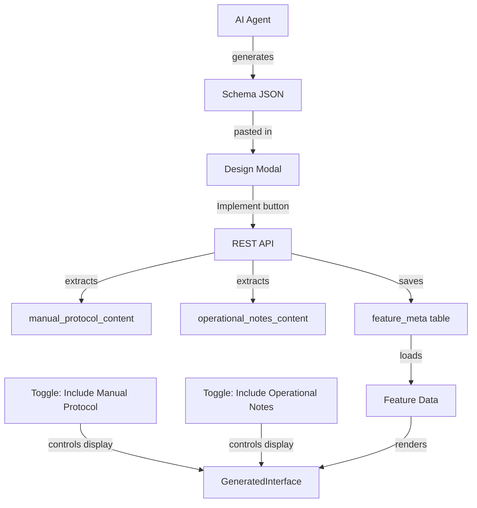

# Implementation Plan: Manual Verification Protocol & Operational Notes Sections

## Overview

This plan addresses the requirement to include "Manual Verification Protocol" and "Operational Notes" sections in the Feature Implementation when the corresponding toggles are enabled in the Design Implementation Modal.

## Current Architecture Analysis

### Data Flow



### Current Implementation

1. **Schema Generation**: AI agent generates schema using `ai_agent_instructions_v2.0.json`
2. **Schema Storage**: Saved in `vaptsecure_feature_meta.generated_schema`
3. **Content Extraction**: REST API extracts `manual_protocol` and `operational_notes` from schema
4. **Toggle Control**: Toggles control **visibility** but not **content generation**

### The Problem

The toggles only control whether existing sections are displayed. If the schema does not contain `manual_protocol` or `operational_notes` content, enabling the toggles has no effect.

## Proposed Solution: Enhance Implement Button

### Approach

Enhance the `handleSave` function in the Design Implementation Modal to inject missing protocol/notes content from the Risk Catalog when toggles are enabled.

### Data Sources Available

| Content Type | Source Location |
|--------------|-----------------|
| Manual Verification Protocol | `testing.verification_steps` from risk catalog |
| Operational Notes | `description.business_impact` or `protection.automated_protection` |

### Implementation Steps

#### Step 1: Fetch Risk Catalog Data

Modify the Design Modal to have access to the original risk data from `interface_schema_v2.0.json`:

```javascript
// In admin.js - DesignModal component
const riskCatalogData = useMemo(() => {
  if (!feature?.key) return null;
  // Fetch from loaded schema or API
  return window.vaptRiskCatalog?.[feature.key] || null;
}, [feature?.key]);
```

#### Step 2: Generate Missing Content

Create helper functions to generate protocol/notes from risk catalog:

```javascript
const generateManualProtocol = riskData => {
  if (!riskData?.testing?.verification_steps) return null;
  return riskData.testing.verification_steps.map(step => ({
    action: step.action || step.description || step,
    expected_result: step.expected_result
  }));
};

const generateOperationalNotes = riskData => {
  const parts = [];
  if (riskData?.description?.business_impact) {
    parts.push(riskData.description.business_impact);
  }
  if (riskData?.protection?.automated_protection?.method) {
    parts.push(`Protection Method: ${riskData.protection.automated_protection.method}`);
  }
  return parts.join('\n\n');
};
```

#### Step 3: Inject Content During Save

Modify `handleSave` to inject content when toggles are enabled:

```javascript
const handleSave = () => {
  // ... existing parsing logic ...
  
  // INJECT: Manual Verification Protocol
  if (includeProtocol && !parsed.manual_protocol && riskCatalogData) {
    parsed.manual_protocol = generateManualProtocol(riskCatalogData);
  }
  
  // INJECT: Operational Notes
  if (includeNotes && !parsed.operational_notes && riskCatalogData) {
    parsed.operational_notes = generateOperationalNotes(riskCatalogData);
  }
  
  // ... continue with save ...
};
```

#### Step 4: Load Risk Catalog in Admin Page

Ensure the risk catalog is available in the admin page:

```php
// In class-vaptsecure-admin.php
wp_localize_script('vaptsecure-admin', 'vaptRiskCatalog', [
  'risks' => $this->load_risk_catalog_data()
]);
```

## Alternative Approaches Considered

### Option 1: Update Schema Button

**Description**: Add a button to regenerate/update schema with protocol/notes

**Pros**:

- Clear user action
- Can re-invoke AI agent

**Cons**:

- Requires AI agent re-invocation
- More complex UI
- User must remember to click

**Verdict**: Not recommended - adds complexity without significant benefit

### Option 2: Enhance Schema Generation

**Description**: Modify AI agent instructions to always include protocol/notes

**Pros**:

- Content always available
- Toggles just control visibility

**Cons**:

- Requires AI agent changes
- All schemas need regeneration
- Larger schema size

**Verdict**: Partial recommendation - can be done as a long-term improvement

## Recommended Implementation

### Phase 1: Immediate Fix - Enhance Implement Button

1. Load risk catalog data in admin page
2. Generate missing content from catalog when toggles enabled
3. Inject into schema before save

### Phase 2: Long-term Improvement - Schema Generation

1. Update `ai_agent_instructions_v2.0.json` to mandate protocol/notes
2. Add self-check rubric items for these sections
3. Regenerate schemas for existing features

## Files to Modify

| File | Changes |
|------|---------|
| `VAPT-Secure/assets/js/admin.js` | Add content generation and injection logic |
| `VAPT-Secure/includes/class-vaptsecure-admin.php` | Load risk catalog data |
| `VAPT-Secure/includes/class-vaptsecure-rest.php` | Optional: Server-side fallback |
| `VAPT-Secure/data/ai_agent_instructions_v2.0.json` | Phase 2: Add mandatory sections |

## Testing Plan

1. **Toggle On + Missing Content**: Verify content is injected from catalog
2. **Toggle On + Existing Content**: Verify existing content is preserved
3. **Toggle Off**: Verify sections are hidden regardless of content
4. **No Catalog Data**: Verify graceful fallback

## Version Bump

This is a feature enhancement: **Minor version bump** (1.9.7 -> 1.10.0)

## Questions for User

1. Should the injected content be editable before implementation?
2. Should we show a preview of the generated content in the modal?
3. Is the risk catalog data sufficient for generating meaningful protocol/notes?
